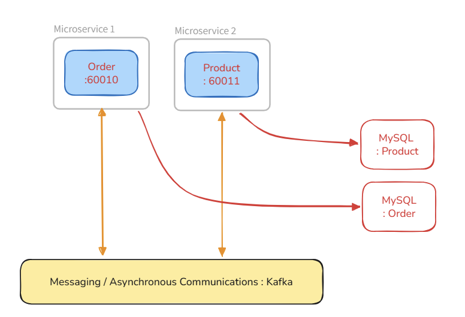
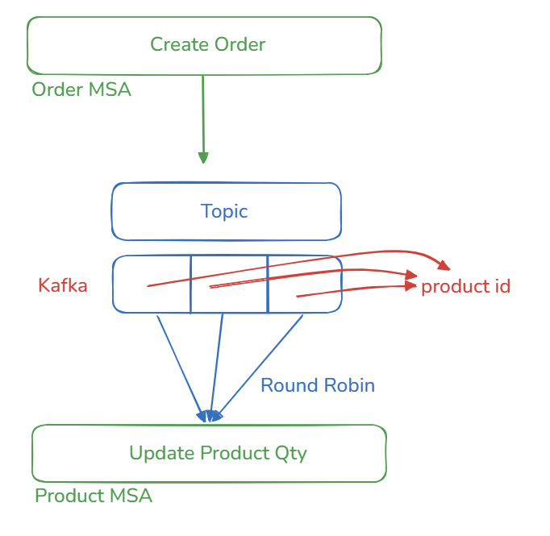
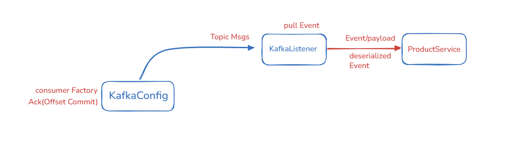
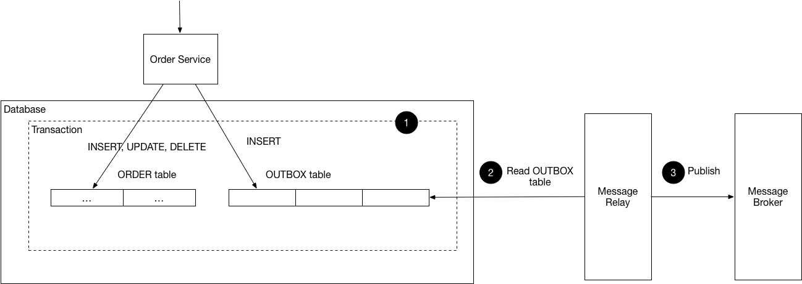
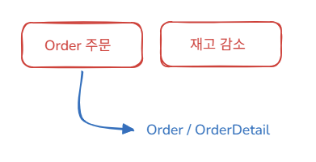

## 1.  개요

> 분산환경에서 Kafka 활용 시 발생가능한 다양한 문제상황을 가정하고 이를 Trouble Shooting.

- Java ver 21.
- Spring Boot ver 3.5.0 / Spring Cloud 2025.0.x Northfields
- apache/Kafka 3.8.0
- MySQL 8.0.42

> System

> SAGA

> Consumer 

## 2. WAS Configs

| Spring Application                       | Host Port | 비고    |
|------------------------------------------|-----------|-------|
| spring-boot-kafka-patterns-order         | 60010     | Producer |
| spring-boot-kafka-patterns-product       | 60011      | Consumer |
| spring-boot-kakfa-patterns-kafka         | 9092      | Kafka |
| spring-boot-kafka-patterns-mysql-order   | 3307      | Order DB |
| spring-boot-kafka-patterns-mysql-product | 3308      | Product DB |

## 3. Trouble Shootings

> Kafka의 메시지 유실 상황에 대한 대응 방안

## 3-1. Consumer의 메시지 처리 실패

``
2026-05-05T19:32:49.713+09:00 ERROR 9584 --- [spring-boot-kafka-patterns-product] [ntainer#0-0-C-1] o.s.kafka.listener.DefaultErrorHandler   : Backoff FixedBackOff{interval=0, currentAttempts=10, maxAttempts=9} exhausted for ORDER.CREATED-0@4
``

기본설정은 10회 재시도(interval = 0, 즉시 재시도, 최대 재시도 횟수는 최초 시도 포함 10번)

``
2026-05-05T20:00:52.797+09:00 ERROR 19612 --- [spring-boot-kafka-patterns-product] [etry-4000-0-C-1] k.r.DeadLetterPublishingRecovererFactory : Record: topic = ORDER.CREATED-retry-4000, partition = 0, offset = 0, main topic = ORDER.CREATED threw an error at topic ORDER.CREATED-retry-4000 and won't be retried. Sending to DLT with name ORDER.CREATED-dlt.
``

구체적인 재시도 정책이 정립될 경우, 더이상 무의미한 재시도를 시도하지 않고 DLT로 전송(send to DLT),

> 사후 DLT 처리방안은 별도 구현이 필요하다.
- 사후처리가 유의미할 경우(일시적인 장애 및 통신오류 등) 기존 토픽에 재전송
- 사후처리가 무의미할 경우 메시지를 폐기 처분
  - DLT는 보통 처리 트래픽이 몰리지 않는 시간에 배치 등을 통해 별도 처리하며, 이는 시스템 상 자원을 필요로 하는 소모이다.
  - Producer 측의 필터 로직이 존재한다면 좋을 것.

``
2026-05-06T16:42:13.686+09:00  INFO 3004 --- [spring-boot-kafka-patterns-product] [ntainer#1-0-C-1] o.a.k.c.c.i.ClassicKafkaConsumer         : [Consumer clientId=consumer-spring-boot-kafka-patterns-product-dlt-7, groupId=spring-boot-kafka-patterns-product-dlt] Seeking to offset 2 for partition ORDER.CREATED.DLT-0
``

dlt 토픽에 메시지가 쌓이면, 메시지를 처리하기 위해 처리 가능(Listener)

## 3-2. Kafka Broker로의 메시지 발행 실패(Kafka 통신 오류 등 치명적 오류에 대한 대응책)

> outbox pattern
- consumer 측의 메시지 처리와는 상관없이 producer의 연산, 메시지 발행 오류 상태에 대한 문제
- 데이터 정합성을 저해할 수 있기에 이에 대한 대응책 필요

- 트랜잭션 레벨에서, 처리 후 바로 메시지 전송이 아닌 outbox에 보관
- 이후 outbox에서 페이로드를 읽고 메시지를 전송, 메시지 유실 방지 및 데이터 정합성을 확보하는 것이 핵심

## 4. Additional KeyPoints

- JPA : Entity Graph

